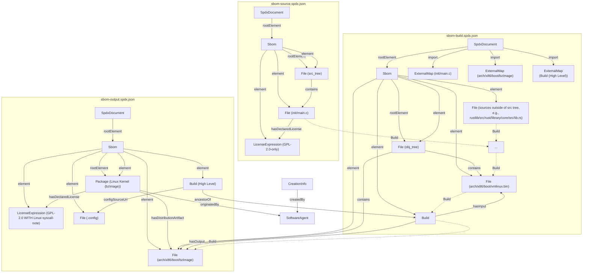
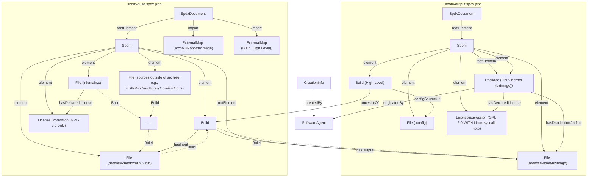

<!--
SPDX-License-Identifier: GPL-2.0-only OR MIT
SPDX-FileCopyrightText: 2025 TNG Technology Consulting GmbH
-->

# KernelSbom

A script to generate an SPDX-format Software Bill of Materials (SBOM) for the linux kernel build.
The eventual goal is to integrate the `sbom/` directory into the `linux/tools/` directory in the official [linux](https://git.kernel.org/pub/scm/linux/kernel/git/torvalds/linux.git) source tree.

## How to use
1. Provide a linux source and object tree, e.g., by downloading precompiled test data from [KernelSbom-TestData](https://fileshare.tngtech.com/d/e69946da808b41f88047/files)
    ```bash
    test_archive="linux.v6.17.tinyconfig.x86.tar.gz"
    curl -L -o "$test_archive" "https://fileshare.tngtech.com/d/e69946da808b41f88047/files/?p=%2F$test_archive&dl=1"
    tar -xzf "$test_archive"
    ```
    or cloning the [linux](https://git.kernel.org/pub/scm/linux/kernel/git/torvalds/linux.git) repo and building your own config
    ```bash
    git clone --depth 1 https://git.kernel.org/pub/scm/linux/kernel/git/torvalds/linux.git
    cd linux
    make <config> O=kernel_build
    make -j$(nproc) O=kernel_build
    ```
2. Clone the repository 
    ```
    git clone git@github.com:TNG/KernelSbom.git
    cd KernelSbom
    ```
3. Run the [sbom.py](sbom/sbom.py) script
    ```bash
    SRCARCH=x86 python3 sbom/sbom.py \
      --src-tree ../linux \
      --obj-tree ../linux/kernel_build \
      --roots arch/x86/boot/bzImage \
      --generate-spdx \
      --generate-used-files \
      --prettify-json \
      --debug
    ```

Starting from the provided root artifact (`bzImage`), the script constructs a **cmd graph**: a directed acyclic graph whose nodes are filenames and whose edges represent build dependencies extracted from the corresponding `.<filename>.cmd` files.

Using this cmd graph, the script generates three SPDX documents and writes them to disk:
- **`sbom-source.spdx.json`** — Describes all source files in the source tree that contributed to building the provided root artifacts (`bzImage`).
- **`sbom-build.spdx.json`** — Describes all build artifacts and the process by which they were built from the sources in `sbom-source.spdx.json`.
- **`sbom-output.spdx.json`** — Describes the final build outputs, i.e., the provided root artifacts.

If the `--generate-used-files` flag is enabled, the script also produces **`sbom.used-files.txt`**, a flat list of all source files in `sbom-source.spdx.json`.

**Note:** If the source tree and object tree are identical, reliably distinguishing source files is not possible. In this case, the source SPDX document is merged into `sbom-build.spdx.json`, and `sbom.used-files.txt` contains all files from `sbom-build.spdx.json`.

### Kernel Modules

To include `.ko` kernel modules in the provided root artifacts, you can use the helper script below to generate a `roots.txt` file:

```bash
echo "arch/x86/boot/bzImage" >> roots.txt
sed 's/\.o$/.ko/' <obj_tree>/modules.order >> roots.txt
```
Then pass the roots file to the main script:
```bash
SRCARCH=x86 python3 sbom/sbom.py \
  --src-tree ../linux \
  --obj-tree ../linux/kernel_build \
  --roots-file roots.txt \
  --generate-spdx \
  --generate-used-files \
  --prettify-json
```

## SPDX Graph Visualization

The following diagrams illustrate the structure of the generated SPDX documents: `sbom-source.spdx.json`, `sbom-build.spdx.json`, and `sbom-output.spdx.json`.

### Separate Source and Object Trees


### Equal Source and Object Trees




## Directory Structure

- `sbom/`
  - `sbom.py` - The main script responsible for generating the SBOM
  - `sbom/sbom/` - Library modules used by the main script
  - `sbom/tests/` - Unit tests for the library modules
- `sbom_analysis/` - Additional scripts for analyzing the outputs produced by the main script.
  - [sbom_analysis/cmd_graph_based_kernel_build/](sbom_analysis/cmd_graph_based_kernel_build/README.md) - Validation of cmd graph completeness by rebuilding the linux kernel only with files referenced in the cmd graph.
  - [sbom_analysis/cmd_graph_visualization/](sbom_analysis/cmd_graph_visualization/README.md) - Interactive visualization of the cmd graph
  - [sbom_analysis/strace_kernel_build/](sbom_analysis/strace_kernel_build/README.md) - build kernel with strace and compare touched files with files found with cmd graph
- `testdata_generation/` - Describes how the precompiled kernel builds in [KernelSbom-TestData](https://fileshare.tngtech.com/library/98e7e6f8-bffe-4a55-a8d2-817d4f3e51e8/KernelSbom-TestData/) were generated.

The main contribution of this repository is the content of the `sbom` directory which eventually should be moved into the `linux/tools/` directory in the official [linux](https://git.kernel.org/pub/scm/linux/kernel/git/torvalds/linux.git) source tree.

## Development

Activate the venv and install build dependencies:
```bash
python3 -m venv .venv
source .venv/bin/activate
pip install pre-commit reuse ruff
pre-commit install
```

When committing, `reuse lint` is run as a pre-commit hook to ensure all files have compliant license headers.  
If any file is missing a license header, it can be added using:
```
reuse annotate --license="GPL-2.0-only OR MIT" --copyright="TNG Technology Consulting GmbH" --template default <filename>
```
> **Note:** If the annotated file contains a shebang, `reuse annotate` will insert an empty line after it. This empty line must be removed manually.

## Run tests
Unit tests can be found in `sbom/tests`. These are designed to be contributed upstream to the `linux` kernel repository.
Integration tests are located in `sbom_integration_tests`. These tests are not intended for inclusion in the kernel repository, as they require a larger number of additional files.

```bash
# Run unit tests
python3 -m unittest discover -v -s sbom -p "test_*.py"
# Run integration tests
python3 -m unittest discover -v -s sbom_integration_tests -p "test_*.py"
```
